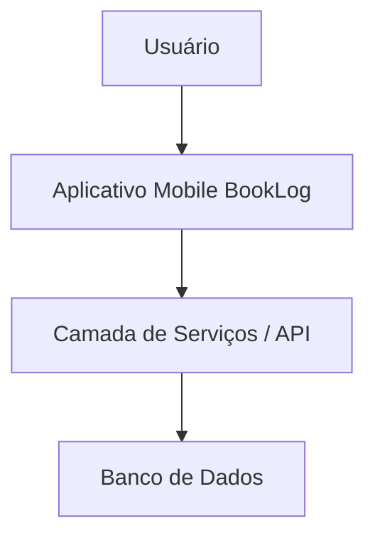

# Arquitetura do Sistema

## Visão geral

O BookLog foi pensado como um aplicativo mobile com separação entre interface,
serviços e dados. A entrega atual implementa a camada mobile com dados mockados
locais, mantendo a arquitetura preparada para uma evolução futura com API e banco
de dados.

## Diagrama textual

```text
Usuário
  ↓
Aplicativo Mobile BookLog
  ↓
Camada de Serviços / API
  ↓
Banco de Dados
```

## Diagrama Mermaid



## Camadas

### Aplicativo mobile

Camada implementada nesta entrega. Contém telas, componentes reutilizáveis,
navegação simulada, estilos, tipos e dados mockados. A implementação está em
React Native, Expo e TypeScript.

### Camada de serviços

Camada conceitual para uma versão futura. Seria responsável por autenticação,
regras de negócio, cadastro de livros, publicação de resenhas, grupos de leitura e
sincronização de dados.

### Banco de dados

Camada conceitual para persistência futura. Armazenaria usuários, bibliotecas,
livros, resenhas, grupos e atividades.

## Dados mockados nesta entrega

Os arquivos em `src/data` representam livros, usuários, resenhas e grupos sem uso
de servidor externo. Essa escolha reduz escopo técnico e permite concentrar a
entrega em IHC, navegação, acessibilidade e documentação.

## Evolução futura

Em uma continuação do projeto, o BookLog poderia receber:

- autenticação real;
- API REST ou GraphQL;
- banco de dados relacional ou NoSQL;
- persistência de progresso de leitura;
- comentários em resenhas;
- recomendações personalizadas;
- notificações de grupos.
